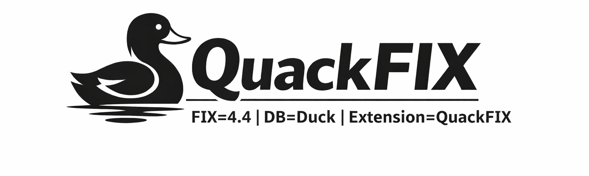

This repository is based on https://github.com/duckdb/extension-template, check it out if you want to build and ship your own DuckDB extension.

---
# DuckDB QuackFIX Extension
Query FIX protocol log files.
---



### What is QuackFIX?

QuackFIX is a DuckDB extension that lets you query FIX logs directly with SQL. It parses raw FIX messages into a structured, queryable format, making FIX log analysis faster and more intuitive for trading, compliance, and financial operations.

### What Sets QuackFIX Apart?

**Native DuckDB Integration**
Query FIX logs directly in DuckDB—no pre-parsing, no pandas round-trips.

**Dialect-Aware**
Supports custom FIX dialects via XML dictionaries, so venue-specific tags just work.

**Fast and Scalable**
Built on DuckDB’s in-memory, columnar engine to efficiently handle large log volumes.

**Less Glue Code**
Replace ad-hoc parsing scripts with a clean, SQL-first workflow.

### Real-World Impact

QuackFIX turns FIX log analysis into a simple SQL problem—spend less time wrangling logs and more time extracting insights.

---

## Installation

```sql
INSTALL quackfix;
LOAD quackfix;
```

## Quick Examples

### 1. Basic: Read FIX Logs
```sql
SELECT * FROM read_fix('logs/trading.fix') LIMIT 10;
```

### 2. Filtering: Find Specific Orders
```sql
SELECT * FROM read_fix('logs/*.fix') 
WHERE MsgType = 'D' AND Symbol = 'AAPL';
```

### 3. Projection: Select Specific Columns (Performance Optimization)
```sql
SELECT SendingTime, Symbol, Side, OrderQty, Price
FROM read_fix('logs/*.fix') 
WHERE MsgType = 'D';
```

### 4. Use Tags: Access Non-Hot Tags
```sql
SELECT Symbol, tags[60] as TransactTime 
FROM read_fix('logs/*.fix');
```

### 5. Aggregation: Analytics on FIX Data
```sql
SELECT Symbol, COUNT(*) as orders, AVG(Price) as avg_price
FROM read_fix('logs/*.fix') 
WHERE MsgType = 'D'
GROUP BY Symbol;
```

## Dictionary Exploration

QuackFIX provides auxiliary functions to explore FIX dictionaries:

```sql
-- Explore all fields in dictionary
SELECT * FROM fix_fields('dialects/FIX44.xml') WHERE type = 'PRICE';

-- Explore fields for a specific message type
SELECT * FROM fix_message_fields('dialects/FIX44.xml') WHERE msgtype = 'D';

-- Explore repeating groups
SELECT * FROM fix_groups('dialects/FIX44.xml');
```

For detailed documentation, see [USERGUIDE.md](USERGUIDE.md).

---

## Building
### Managing dependencies
DuckDB extensions uses VCPKG for dependency management. Enabling VCPKG is very simple: follow the [installation instructions](https://vcpkg.io/en/getting-started) or just run the following:
```shell
git clone https://github.com/Microsoft/vcpkg.git
./vcpkg/bootstrap-vcpkg.sh
export VCPKG_TOOLCHAIN_PATH=`pwd`/vcpkg/scripts/buildsystems/vcpkg.cmake
```
Note: VCPKG is only required for extensions that want to rely on it for dependency management. If you want to develop an extension without dependencies, or want to do your own dependency management, just skip this step. Note that the example extension uses VCPKG to build with a dependency for instructive purposes, so when skipping this step the build may not work without removing the dependency.

### Build steps
Now to build the extension, run:
```sh
make
```
The main binaries that will be built are:
```sh
./build/release/duckdb
./build/release/test/unittest
./build/release/extension/quackfix/quackfix.duckdb_extension
```
- `duckdb` is the binary for the duckdb shell with the extension code automatically loaded.
- `unittest` is the test runner of duckdb. Again, the extension is already linked into the binary.
- `quackfix.duckdb_extension` is the loadable binary as it would be distributed.

## Running Tests
```sh
make test
```

## Deployment

### Installing the deployed binaries
To install your extension binaries from S3, you will need to do two things. Firstly, DuckDB should be launched with the
`allow_unsigned_extensions` option set to true. How to set this will depend on the client you're using. Some examples:

CLI:
```shell
duckdb -unsigned
```

Python:
```python
con = duckdb.connect(':memory:', config={'allow_unsigned_extensions' : 'true'})
```

NodeJS:
```js
db = new duckdb.Database(':memory:', {"allow_unsigned_extensions": "true"});
```

Secondly, you will need to set the repository endpoint in DuckDB to the HTTP url of your bucket + version of the extension
you want to install. To do this run the following SQL query in DuckDB:
```sql
SET custom_extension_repository='bucket.s3.eu-west-1.amazonaws.com/<your_extension_name>/latest';
```
Note that the `/latest` path will allow you to install the latest extension version available for your current version of
DuckDB. To specify a specific version, you can pass the version instead.

After running these steps, you can install and load your extension using the regular INSTALL/LOAD commands in DuckDB:
```sql
INSTALL quackfix;
LOAD quackfix;
```
